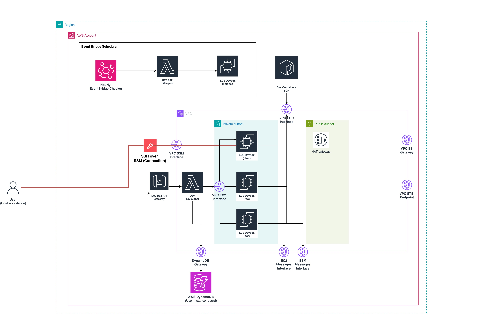
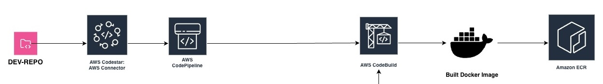

# Dev Container Infrastructure

AWS CDK infrastructure for multi-user cloud-based development environments with per-user EC2 devboxes with companion CLI.

Unlike browser-based IDEs (GitHub Codespaces, AWS Cloud9), this uses your **local VS Code** connected to remote EC2 instances via SSH-over-SSM, allowing for the full desktop programming experience with all extensions, themes and keybindings available to you. You can also use Docker containers (Dev Containers) for isolated development environments on the remote instance.

## Overview

Two CDK stacks:

- **DevContainerBuildStack**: Builds and publishes dev container images to ECR via CodePipeline (OPTIONAL)
- **CloudDevEnvStack**: Provisions per-user EC2 devboxes with API management

## Architecture

### Cloud dev environment (CloudDevEnvStack)



### Dev container build pipeline (DevContainerBuildStack)



```bash
CodePipeline → CodeBuild → ECR (dev_container_ecr:linux-amd64-*)
Developer → API Gateway → Lambda → EC2 devbox (Docker + workspace)
EC2 devbox → SSM Session Manager (no SSH keys/ports)
EC2 devbox → ECR (pull images) + S3 (artifacts)
Scheduled Lambda → Stop idle instances, terminate old instances
```

## Prerequisites

- AWS CLI with admin credentials
- Node.js 18+ and npm
- AWS CDK: `npm install -g aws-cdk`
- Session Manager plugin (for devbox access)
- jq

## Quick Start

### 1. Install dependencies

```bash
npm install
cd lambda/provisioner && npm install && cd ../..
```

### 2. Configure (TODO items)

Update these files before deployment:

**lib/dev-container-build-stack.ts**:

- Line ~50: IAM group name (`dev-access-group`)
- Line ~100: GitHub org/repo (`YOUR_GITHUB_ORG/YOUR_REPO_NAME`)
- Line ~150: GitHub OIDC trust policy
- Line ~180: CodePipeline source action

**lib/cloud-dev-env.ts**:

- Line ~80: IAM group name (`dev-access-group`)

**docker/buildspec.yml**:

- Line 5: AWS region
- Line 7: S3 bucket name
- Lines 9-10: Licensed artifacts (if needed)

### 3. Deploy stacks

```bash
cdk bootstrap  # first time only
cdk deploy CloudDevEnvStack  # Deploy this first to create IAM groups
cdk deploy DevContainerBuildStack
```

Note: Deploy CloudDevEnvStack first as it creates the IAM groups used by both stacks.

### 4. Post-deployment

1. Approve CodeStar connection in AWS Console:
   - Service: CodeStar Connections
   - Connection: `dev-container-github-connection`
2. Upload artifacts to S3 bucket (if needed): Check `ArtifactsBucket` output
3. Optional: Use `GithubActionCodebuildRoleArn` for GitHub Actions integration

## CLI Quick Guide (devbox)

The `devbox` CLI in `cli/` wraps provisioning, status checks, and SSH helpers.

Install:

```bash
cd cli
npm install
npm link
```

Common commands:

```bash
devbox cloud status
devbox cloud provision --wait
devbox cloud init
devbox cloud connect
```

Devcontainer command (TODO stub, no files generated yet):

```bash
devbox devcontainer generate --project-dir /path/to/repo
```

## Using Devboxes

You can use the CLI above or call the API directly.

### Provision via API

```bash
API_URL=$(aws cloudformation describe-stacks \
  --stack-name CloudDevEnvStack \
  --query 'Stacks[0].Outputs[?OutputKey==`ApiUrl`].OutputValue' \
  --output text)

USER_ID=$(aws sts get-caller-identity --query 'Arn' --output text | awk -F'[:/]' '{print $NF}')

curl -X POST "${API_URL}devbox" \
  -H "Content-Type: application/json" \
  -d '{"action": "provision", "userId": "'"$USER_ID"'"}'
```

Wait 2-3 minutes for first boot.

### Connect via SSM

```bash
# Get instance ID from DynamoDB or API
aws ssm start-session --target i-xxxxxxxx --region us-east-1
```

### Connect via VS Code Remote-SSH

1. Install "Remote - SSH" extension
2. Add to `~/.ssh/config`:

   ```ssh-config
   Host devbox-*
     ProxyCommand sh -c "aws ssm start-session --target $(aws ec2 describe-instances --filters 'Name=tag:User,Values=%h' --query 'Reservations[0].Instances[0].InstanceId' --output text) --document-name AWS-StartSSHSession --parameters 'portNumber=%p'"
     User ec2-user
   ```

3. Connect to `devbox-<userId>`

### Use Dev Containers

Pull the image on your devbox:

```bash
# NOTE: SAMPLE
REGION=us-east-1
ECR_REPO=dev_container_ecr
ACCOUNT_ID=$(aws sts get-caller-identity --query Account --output text)
aws ecr get-login-password --region "$REGION" | \
  docker login --username AWS --password-stdin "$ACCOUNT_ID.dkr.ecr.$REGION.amazonaws.com"

docker pull "$ACCOUNT_ID.dkr.ecr.$REGION.amazonaws.com/$ECR_REPO:linux-amd64-latest"
```

In VS Code: "Dev Containers: Reopen in Container"

## IAM Permissions

### dev-access-group (developers)

Permissions:

- SSM sessions to tagged instances (`ManagedBy=devbox-provisioner`)
- EC2 describe instances
- DynamoDB read (user table)
- Lambda invoke (provisioner)
- S3 read/write (artifacts bucket)
- ECR pull images

Cannot:

- Access other users' devboxes
- Modify infrastructure
- Deploy/delete stacks

### dev-all-access (admins)

Full admin access. Use MFA.

## Devbox Lifecycle

- **Idle stop**: CPU < 5% for 2 hours → stopped
- **Age cleanup**: Running > 7 days → terminated
- Cleanup runs hourly via EventBridge + Lambda

## Components

### DevContainerBuildStack

- ECR repository: `dev_container_ecr`
- S3 bucket: `dev-container-artifacts-<region>`
- CodePipeline + CodeBuild
- GitHub CodeStar connection
- GitHub Actions OIDC role (optional)

### CloudDevEnvStack

- VPC with private subnets + VPC endpoints (SSM, ECR, S3, STS, DynamoDB, EC2)
- Launch template: Amazon Linux 2023, t3.medium, 50GB EBS
- DynamoDB: userId → instanceId mapping
- Lambda provisioner (provision/stop/terminate)
- API Gateway: `/devbox` endpoint
- Lifecycle Lambda (cleanup)
- S3 artifacts bucket

## Cost Notes

- t3.medium: ~$0.04/hour
- 50GB EBS: ~$5/month (even when stopped)
- NAT Gateway: ~$32/month
- Cleanup reduces idle costs

## Troubleshooting

- **"No devbox found"**: Provision first or check DynamoDB
- **SSM timeout**: Verify instance running + SSM agent
- **VS Code connection fails**: Check Session Manager plugin + AWS credentials
- **Image pull fails**: Verify ECR permissions + login

## File Structure

```text
bin/dev-container-infra.ts        # CDK app entry
lib/
  dev-container-build-stack.ts    # Build pipeline
  cloud-dev-env.ts                # Devbox platform
  constructs/
    devbox-network.ts             # VPC + endpoints
    devbox-shared-resources.ts    # Launch template + IAM
    devbox-provisioner.ts         # Lambda provisioner
    devbox-lifecycle.ts           # Cleanup Lambda
    devbox-api.ts                 # API Gateway
lambda/provisioner/provision.js   # Provisioner logic
docker/
  Dockerfile                      # Dev container image
  buildspec.yml                   # CodeBuild spec
```

## Stack Outputs

**DevContainerBuildStack**:

- `ArtifactsBucket`: S3 bucket name
- `ConnectionARN`: GitHub connection ARN
- `GithubActionCodebuildRoleArn`: GitHub Actions role

**CloudDevEnvStack**:

- `ApiUrl`: Devbox API endpoint
- `ProvisionerArn`: Lambda ARN
- `UserTable`: DynamoDB table name
- `ArtifactsBucket`: S3 bucket name
